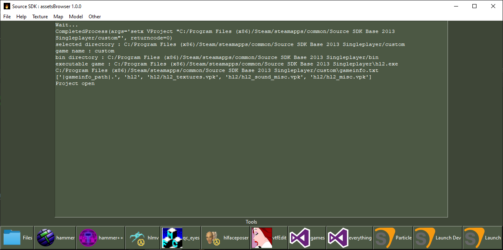
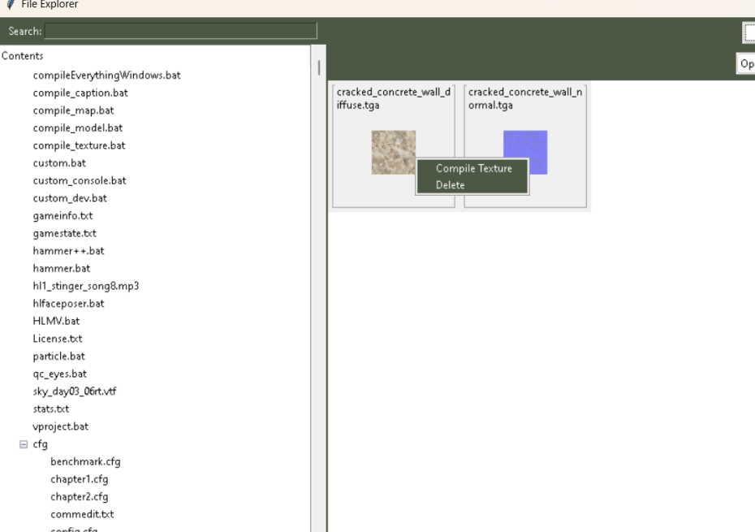
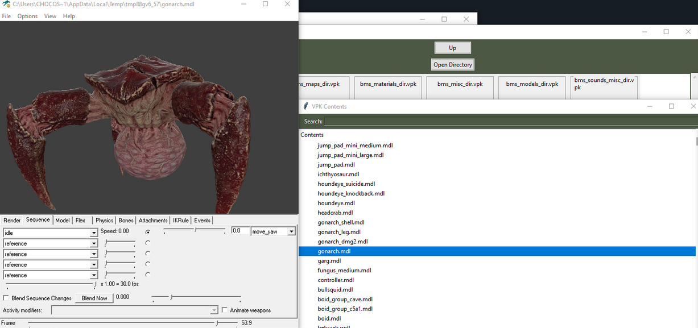

# Asset Browser

<https://github.com/ChocoScaff/SourceSDK-/releases>

Asset Browser est un outil crée par ChocoScaff, qui permet d'avoir une interface avec les logiciels et permet d'avoir un accès au fichier du projet.

Avec l'outil fichier, vous pouvez observer les fichiers du projet, compiler les texture ou model.

On peut ouvrir les fichiers .vpk et voire les fichiers à l'intérieur et les extraires.

