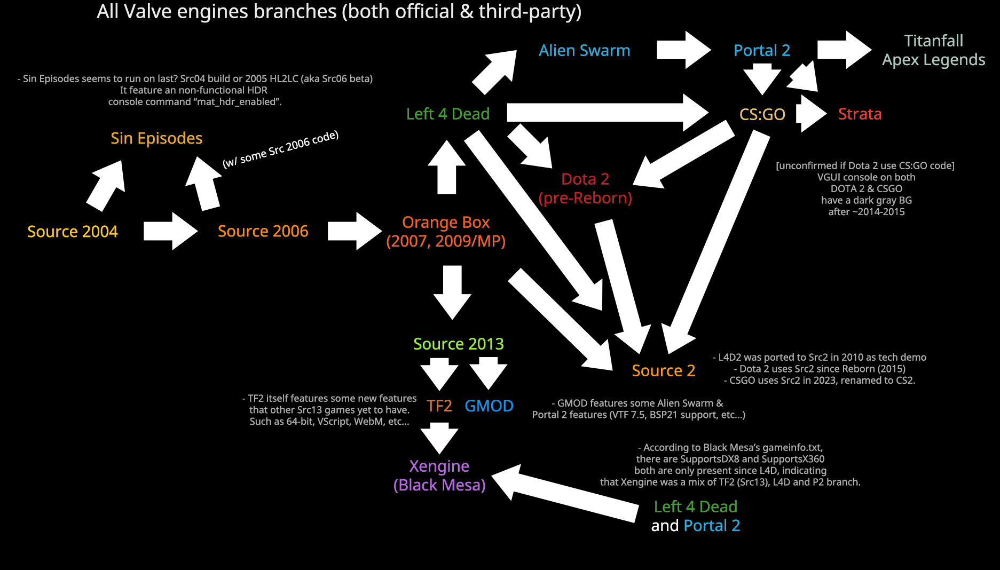

# Choix d'une branch

Avant de commencer à dévelloper un mod, vous devez choisir une branche, le source engine à connu plusieur version au cours de son exploitations, en fonction de la branche choisie vous n'aurez pas les mêmes fonctionnalités. 
Les différences sont la version du moteur qui pourra avoir une version différent de directX, des shaders different, une nouvelle interface, etc...
Le choix peut se faire si vous préférez créer un mod sur un jeu en particulier.

