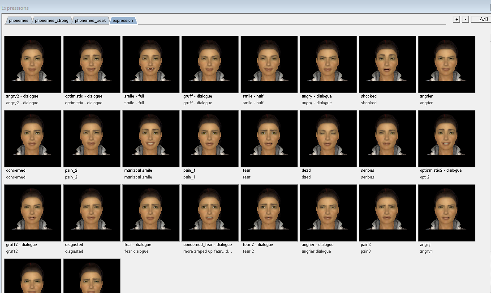
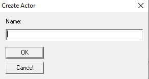

# Système de dialogue

Ce chapitre a pour but de vous créer des dialogues avec vos npc. Nous allons utiliser le logiciel *hlfaceposer*.*exe* dans le dossier bin du moteur source.

## Expression

Le système *Flex Sliders* pemet de tester les expressions de votre personnage

Pour sauvegarder les expressions, il faut créer un fichier *.txt* dans le dossier expressions (cf. [Exemple expressions.txt](ressource/expressions.txt) )

Ce fichier contient les variables des *flex sliders*.

Vous pouvez voire tous les expressions lister dans le fichier avec la fenêtre expression.

## Choreography

Crée un nouveau fichier *.vcd* dans le dossier *scene* avec *Choreography->new...*

Nommer votre acteur

Cliquer sur le nom de votre acteur et crée un nouveau *channel* associer à un acteur. Les *channel* sont comme une timeline dans les logiciels de montage.

Vous pouvez mettre votre fichier audio, les expressions et les gestures de la scène.

## Dialogue dans Hammer

Placer un *logic_choreographed_scene* dans *hammer* et sélectionner votre fichier *.vcd*

