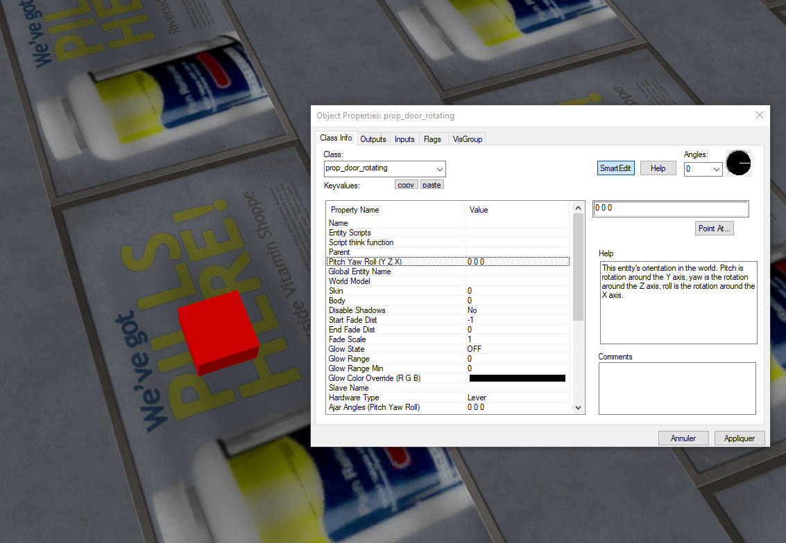
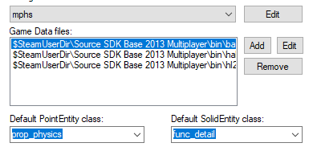

# Entity Tool

Dans les entity tools, il existe plusieurs *Class*, nous allons décrire une parties d'entres elles

*info_player_start*

- Définie où le joueur va apparaître

*Light*

- Permettent de définir les lumières



## Prop

Quand un prop est appliqué, on a un carré rouge qui s'affiche est une nouvelle fenêtre, sur cette nouvelle fenêtre, on a «World Model» qui permet de faire prendre une apparence au prop à partir de la bibliothèque des modèles 3D du jeu.

Nous avons plusieurs Props

Prop_Rotating_Door

- Ce prop permet de créer une porte, qui s'ouvre quand le joueur interagi avec.

Prop_physics

- Crée des modèles avec des propriétés physiques ce modèle peut aussi être brisé.

Prop_detail

- N'a pas de collision ni de propriété physique À utiliser pour les décors d'arrière-plan.

Prop_static

- c'est un prop qui ne bouge pas, ils n'ont pas propiété physique sauf la collision.

- ne peut pas avoir d'animation.

## Ajouter une entité dans le répertoire de hammer

Pour ajouter une entité, nous allons créer un fichier *.fdg* avec sa nous pouvons ajouter notre entité écrit en C++ cf. [Ajouter une entité](programmation.md#ajouter-une-entite)

Ici pour ajouter une arme.
```cpp
@PointClass base(Targetname, Angles, Origin) studio("path/model.mdl") = example_entity_name : "example entity description, visible in Hammers 'help' Box. 
[

	Property_name_1(string) 	: "Example String Name"		: "Example"	: "Keyvalue Description"
	Property_name_2(integer) 	: "Example Interger Name"	: 15		: "Keyvalue Description"
	Property_name_3(float)		: "Example Float Name" 		: "1.5"		: "Keyvalue Description"
	Property_name_4(boolean)	: "Example Boolean Name"	: 1 		: "Keyvalue Description"
	
	Property_name_5(choices) : "second number" : 0 : "Your choice of numbers!" =
	[
		0 : "Default"
		1 : "Something"
		2 : "Another Thing"
	]

	spawnflags(flags) =
	[
		1 : "A flag"       : 0 // 0 means the flag isn't ticked by default
		2 : "Another flag" : 1 // 1 means the flag is ticked by default
	]
	
	// Inputs
	input DoSomething(void) : "Do something"	
	// Outputs
	output OnSomethingHappened(void) : "Fires when something happens"
	output OnSomethingElse(void) : "Fires when something else happens"

]
```
Ici pour ajouter un prop.

Ajouter le fichier *.fdg* dans les Data files de Hammer.



<div style="page-break-after: always"></div>