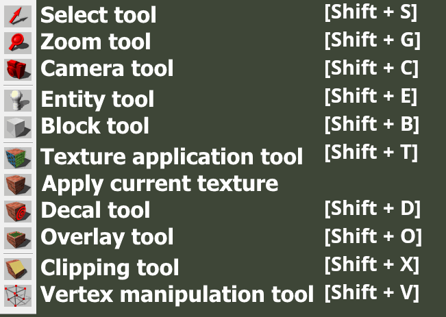
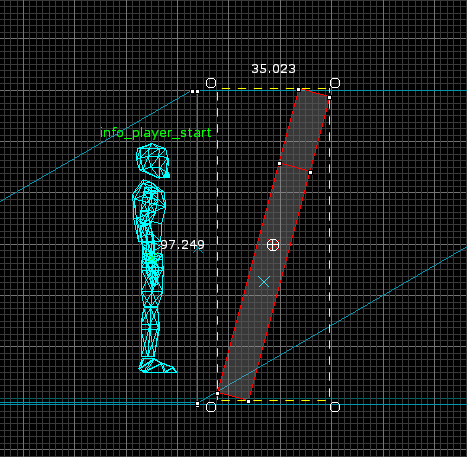
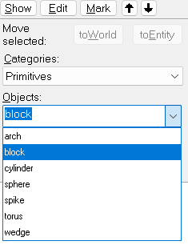
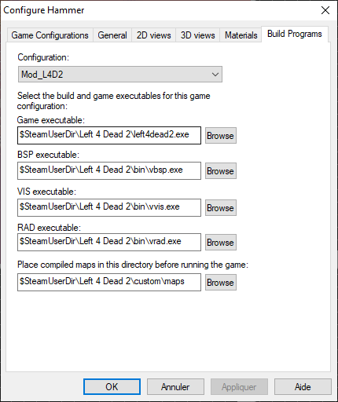

# Les Outils d'hammer

*Hammer* est un éditeur de map permettant de transformer une map que l'on a dessinée vers un format pouvant être lu par le moteur du jeu. Plusieurs conversions sont faite d'abord, on met le fichier *.vmf* qui est un fichier texte vers le format *.bps*, puis on découpe l'espace avec vis, pour l'optimisation et on finit par calculer la lumière avec rad.

## Outils

Comme beaucoup d'autres logiciels *Hammer* comporte des outils.

Selection Tools

- Racourcis Shift + S

- Il permet tout simplement de sélectionner un objet.

Magnify

- RacourcisShift + G

- Permet de zoomer.

Caméra

- Racourcis Shift + C

Entity tools

- Racourcis Shift + E

- Permet de créer des entités objet, lumières, personnages. etc...

Block Tools

- Racourics Shift + B

- Permet la création d'un block.

Toogle Texture

- Permet l'application d'une texture

Apply current Texture

- Permet d'appliquer la texture sur le block sélectionné.

Racourcis utiles

- [ ou *alt + a* ajoutes des lignes sur la grille.

- ] ou *alt + s* enlève des lignes sur la grille.

- 1 à 0 zoom plan en 2D.

- niveau de zoom 1 faible. 0 élevé.

- shift + Z n'affiche qu'une seule fenêtre.

- shift + W magnétique.

## Fenêtre

*Hammer* de divise en 4 fenêtres *"View"* en anglais

De gauche à droite et de haut en bas.

La première "*View*" caméra est une "3D Textured Polygons", la deuxième view est une "2D top (x/y)", la troisième view est une "2D front (y/z)" la quatrième view est une "2D side (x/z)".

Nous pouvons changer les *view* en cliquant sur une view puis sur le panneau du haut pour changer de *view*.

## Faire une Rotation

Il existe plusieurs moyens de faire une rotation

Nous pouvons le faire de manière manuel. Pour cela, il faut cliquer une fois sur un objet depuis une fenêtre "*2D View*" vous devez voir des ronds et non des carrés sur l'objet, la rotation depuis une croix celte placer au mileu de l'objet nous pouvons la déplacer pour changer l'angle de rotation.

Sinon depuis une "2D View' faire un clique droit cliquer sur "Transform" rac ctrl+m, nous avons le choix entre changer la rotation (Rotate), l'échelle (Scale) et aussi la position (move).

## Crée un Cylindre et une Arche

Avec l'outils Block tracé changer *Objects* en bas à droite, vous aurez le choix entre.

- *"Cylinder"* pour faire un cylindre 
- "*Arch*" pour créer une arche 
- "*sphere*" pour créer une sphère 
- "*Torus*" pour créer une forme de donut 
- "*Wedge*" pour créer un triangle
- "*Spike*" pour créer une forme pointu

## Configurer Hammer

 

-**Configuration** fait Edit et ajouter un nom à votre configuration

-**Game Data Files** ajouter les fichiers *.fgd* de votre mod

**-Texture Format** laisser en *Half-Life 2*

**-Map Type** laisser en *Half-Life 2*

**-Default PointEntity class** Vous pouvez mettre l'entity par défaut quand vous ajoutez une.

**-Default SolidEntity class** Mettre le *SolidEntity* par défault

**-Cordon texture** Metter *tools/toolsskybox*

-**Game Executable Directory** Mettre le *.exe* de votre mod (hl2.exe)

-**Hammer VMF Directory** Mettre le dossier *mapsrc* de votre mod

-**Game Executable** Mettre le *.exe* de votre mod

**-BSP Executable** Mettre *bin/vbsp.exe*

**-VIS Executable** Mettre *bin/vvis.exe*

**-RAD Executable** Mettre *bin/vrad.exe*

**-Place Compiled maps in this directory before running the game** Mettre le dossier maps de votre mod

## Utiliser les textures Blends

Crée un displacement de votre face sélectionner dans *Hammer* avec l'outil **toggle texture aplication**.

Il suffit maintenant d'utiliser l'option **Paint Alpha**, pour peindre notre texture cf. [Texture Blend](texture.md#texture-blend)

