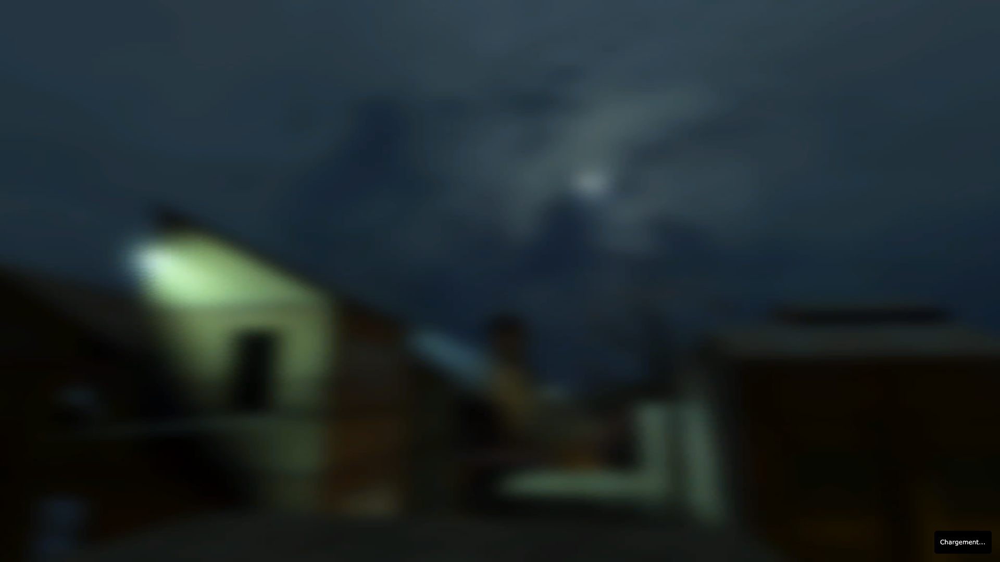
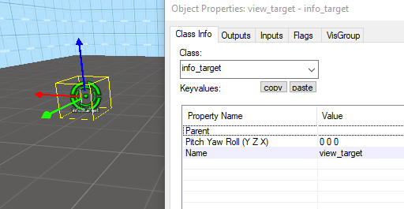

# Level Design

## Carte Background

Dans le menu principal, vous pouvez avoir une carte qui tourne dans votre menu ou une simple image.


Dans le fichier *scripts/chapterbackgrounds.txt*, vous pouvez associer à un bakground.
```
"chapters"
{
	1	"background01"
	2	"background01"
	3	"background02"
	4	"background02"
	5	"background03"
	6	"background03"
	7	"background04"
	8	"background04"
	9	"background05"
	9a	"background05"
	10	"background06"
	11	"background06"
	12	"background07"
	13	"background07"
	14	"background07"
	15	"background07"
}
```

Notre image ou/et map doit avoir le même nom.

*materials\console\background01.vmt*

*maps\background01.bsp*

Il est possible d'utiliser une image flou pendant le chargement pour faire un effet de transition.

 

Pour ce faire la placer une caméra(*point_viewcontrol*) qui va filmer la scène en créant un *entity*.


Placer le point que va regarder la caméra *(info_target)* en créant un *entity* de Class *info_target*.



On peut activer la caméra avec un *logic_auto*.


## Grille

Sur le panneau «*View* » vous pouvez modifier la grille sur «*Set Grid Size*».

Voilà à quoi correspond les tailles de la Grille.


  | **Grille** | **Mètre** |                **Note**                 |
  |:----------:|:---------:|:---------------------------------------:|  
  |     1      | 1,905 cm  
  |     2      |   ~4 cm   
  |     4      |  ~7,5 cm  
  |     8      |  ~15 cm   
  |     16     |  ~30 cm   
  |     28     |  ~55 cm   | Hauteur champ vision accroupie (joueur)
  |     32     |  ~60 cm   | Collision largeur,longueur (joueur)
  |     36     |  ~70 cm   | Collision hauteur accroupie (Joueur)
  |     48     | ~90 cm | Largeur porte
  |  52.49344  | 1 m
  |     64     | ~1,2m | Hauteur champ vision debout (joueur)
  |     72     | ~1,4m | Collision hauteur debout(joueur)
  |    108     | ~2m | Hauteur porte
  |    128     | ~2,5m | Hauteur couloir
  |    160     | ~3m
  |    256     | ~5m
  |    512     | ~9,75m             


## Tool Textures

Ces Textures sont des textures invisibles qui servent pour communiquer au moteur des éléments

*Block Bullets*

Permet de bloquer les balles des armes des joueurs et des PNJ (mais ne bloque pas jets des pnj comme les jets d'acide)

*Ladder*

Permet de créer une échelle pour le jeu, elle est invisible pour le joueur

*Trigger*

Texture d'Optimisation

Les block d'optimisation sont décrits cf. [7.2 optimisation](#72-texture-doptimisation)

## Conseils pour créer ses cartes

Faire un Plan de sa carte.

Faites un croquis de votre idée puis au fur et à mesure faites un dessin avec les  dimensions souhaitées cela vous fera gagner beaucoup de temps sur le long terme,  car vous ferez pleins d'erreurs si vous commencez sans faire de dessin.

La carte doit être amusante à jouer.

La carte doit s'adapter au gameplay du jeu si vous faites une carte de fps compétitif comment faire pour que la carte soit équilibrée et offres des possibilités et des situations de jeux intéressantes demandez-vous "qu'est-ce qu'on peut faire, et qu'est-ce qu'on ne peut pas faire?"

Commencer simple.

Utiliser une texture développeur durant la fabrication de votre ne vous embêter pas à chercher des bonnes textures dès le début ou à mettre des decals, le but premier est qu'elle soit bien faites et quelle sert le gameplay.


Faites les détails à la fin pour embellir votre carte.

Regardez comment font les professionnels.

Dans les dossiers "*sourcesdk_content\hl2\mapsrc*" nous avons une liste de cartes regardez comment elles sont faîtes et comprendre pourquoi les développeurs ont fait sa.

## Debugger sa carte

Prenez le fichier *debugoption.txt* cf. [debugoptions.txt](ressource/debugoptions.txt) et metterle dans le dossier /youModName/scripts/

Entrer les paramètres suivant dans la console.

```
sv_cheats 1
developer 1
```

Ouvrez avec *Shift + F1*


<div style="page-break-after: always"></div>