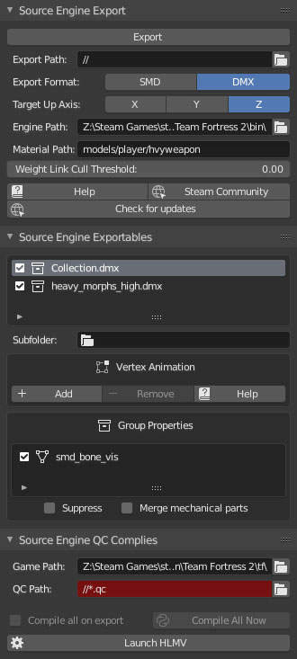
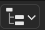

# Modèle 3D

<https://www.blender.org/>

<http://steamreview.org/BlenderSourceTools/>

Ce chapitre a pour but de mettre vos modèles 3d crée dans votre mod source, importation se passe en 2 étapes la premier, vous devez export depuis vers un format*.smd* ou *.dmx* avant d'exporter vers un fichier *.mdl* utilisable dans Source.

## Crée un modèle 3D

Nous allons créer un modèle 3D sur Blender logiciel gratuit et libre, pour télécharger Blender [cliquer ici](https://www.blender.org/).

Nous allons ajouter un addon pour cela [cliquer ici](http://steamreview.org/BlenderSourceTools/).

Lancez Blender, Allez sur *Edit\Preferences*.

Sur le préférences allez sur add-ons puis cliquez sur install en haut à droite sélectionner le fichier «blender_source_tools_3.2.5.zip».

Activer «Import-Export: Blender Source Tools» il faut que la case soit coché.


## Exporter le modèle 3D sur Source

Aller dans la fenêtre *propretie*  (shift + 7 ou à droite si vous êtes sur le layout par défault)

 *scene -> source engine*



Allez sur *Scene* dans les *Properties* puis sur *Source Engine Export*.

**Export Path:**

- Indiquer le dossier où sera exporter le modèle 3D en .*smd* (modelsrc)

**Engine Path:**

- Dossier Bin du moteur ( exemple: */steam/steamapps/common/Counter-Strike Global Offensive/bin*)

**Material Path:**

- Texture du modèle 3D (exemple: (*hl2/materials/)models/prop/computer*)
(**Seulement si vous choisissez .DMX**)

Une fois fait cliquer sur «*Export*»

sur **Source Engine QC Complies**

**Game Path:** 
- Indiquer le dossier de données de votre mod (hl2).

**QC Path:** 
- Fichier *.qc* avec tout les infos de compilation par *.qc* dans le même dossier que *.smd* (modelsrc)

une fois appuyer sur *Compile All Now* cela va activer la compilation.

La compilation se passe en 2 étape vous aller compiler le modèle 3D en *.smd* puis en *.mdl*.


Une fois compilé utiliser, le logiciel hlmv.exe pour obsever le model 3d.

N'oublier pas d'exporter les textures du modèle 3D dans le dossier suivante.

«dossier de données» */materials/models/*

Attention! La collection le modèle et le matérials doivent avoir le même nom.

Vérifier dans outliner
 (shift + F9 ou à droite du layout par défault)


## Faire un fichier .QC

<https://developer.valvesoftware.com/wiki/QC>

### Conversion d'un simple model 3D

Fichier *.qc* est juste un fichier texte, on  l'on va mettre dedans les informations lier au type de modèle.

Remplacer «*myfirstmodel*» par le nom de votre modèle.

```cpp
$modelname "props_sdk\myfirstmodel.mdl" //le nom du modèle 3D son corps

$body mybody "myfirstmodel-ref.smd" //les vertex fait sous blender

$surfaceprop combine_metal //Le type de surface

$cdmaterials "models\props_sdk" //Repertoire de la texture

$collisionmodel "myfirstmodel-phys.smd" //Les collision

$sequence idle "myfirstmodel-ref.smd" // Séquence sans animation
```


### Ajouter des informations pour les props

Exemple pour un prop en verre

```cpp
$keyvalues
{
	prop_data 
	{
		"base"				"Glass.Base"    // Matériau de base défini comme "Glass.Base"
		"dmg.explosive" 	"1.0"			// Remplace le comportement explosif de base du verre
		"dmg.bullets"		"1.0"           // Dommages causés par les balles
		"health"			"1"             // Santé du matériau
		"damage_table"		"glass"         // Tableau de dommages nommé "glass"
	}
	BreakableModels
	{
		GlassChunks
		{
			models\gibs\glass_shard01.mdl    // Modèle de fragment de verre 01
			models\gibs\glass_shard02.mdl    // Modèle de fragment de verre 02
			models\gibs\glass_shard03.mdl    // Modèle de fragment de verre 03
			models\gibs\glass_shard04.mdl    // Modèle de fragment de verre 04
			models\gibs\glass_shard05.mdl    // Modèle de fragment de verre 05
			models\gibs\glass_shard06.mdl    // Modèle de fragment de verre 06
		}
	}
}

```

## Vérifier modèle 3D

Aller dans dossier *bin* et ouvrez le logiciel *hlmv* ou cliquer sur ***Launch HLMV*** sur Ouvrez votre modèle 3D et vérifier bien qui s'affiche comme il faut.

## Exporter animation 

Dans cette exemple, j'utilise le model trouvable dans

*common\sourcesdk_content\hl2\modelsrc\humans_sdk\male_sdk\male_06_reference.smd*.

Faite *file-\>import-\>Source Engine*


Donner un nom à votre animation et exporter la en *.smd*.

 

Ajouter l'animation dans la liste des sequences du fichier *.qc* (voir Faire un fichier QC).

```cpp
$sequence "idle" "male_06_reference.smd"

$sequence "attack" "animation1.smd" fps 24
```
Vous pouvez visualiser l'animation dans l'onglet *Sequence* de *hlmv*.


<div style="page-break-after: always"></div>
