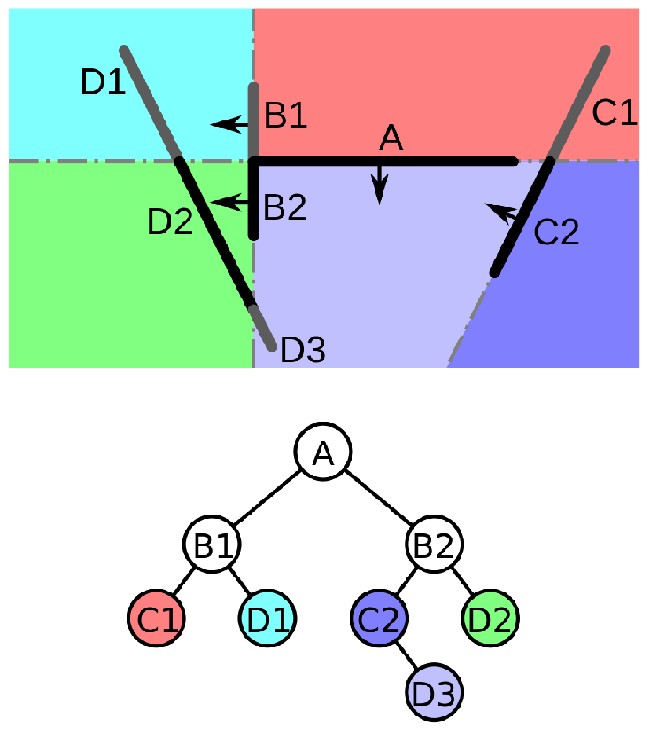

# Optimisation

<https://www.youtube.com/watch?v=FRwAmlOT4zc>

Le moteur source utilise pour faire son optimisation un arbre BSP (*binary space partitioning)*

celui-ci permet d'organiser les pièces d'une cartes dans un ordre hiérarchique le principe étant que ceux que le joueur ne voit pas, ne soit pas charger et donc économiser en ressource

Ici l'arbre commence par A et se divise en sous catégories.

Quand le jeu Calculs D3, l'ordinateur sait qu'il n'a pas besoin de charger B1 car la pièce n'est pas reliée.

## Visleaves

Le Source Engine utilise Vis pour créer son Abre *BSP*, il divise les salles lors de l'optimisation

La commande "*mat_leafvis 3*" sur la console permet de les voir en jeu

Exemple de *vis* visible en jeu

Pour plus d'information sur les *vis* il y a cette vidéo : [POURQUOI NOS JEUX SONT MAL OPTIMISÉS ?](https://www.youtube.com/watch?v=FRwAmlOT4zc)

## Texture d'Optimisation

Dans la liste des textures, il existe certaines textures qui permettent d'améliorer l'optimisation du jeu, elles sont invisible pour le joueur.

Hints

- Malheureusement vis ne comprend pas toujours comment bien crée les pièces, dans le choix des textures lorsque l'on crée un block, nous avons une Texture "Hints" celle-ci permet d'indiquer qu'une pièce est fermé

Nodraw

- Les Nodraw sont des textures qui n'apparaissent pas, elles sont utilisé dans les angles morts ceux que le joueur ne voit pas

Areapportals

- <https://developer.valvesoftware.com/wiki/Areaportal>

- Les areaportal sont très utile pour optimiser la visibilité entre deux Vis d'une porte ou d'une fenêtre.

 

Pour créer un areaportal crée un bloc avec la texture toolsareaportal et transformer ensuite vers une entité (CTRL+T).

***func_areaportal*** : AreaPortal normal

***func_areaportalwindow*** : AreaPortal qui va en plus faire un fondu, passer une certaine distance spécifier.

