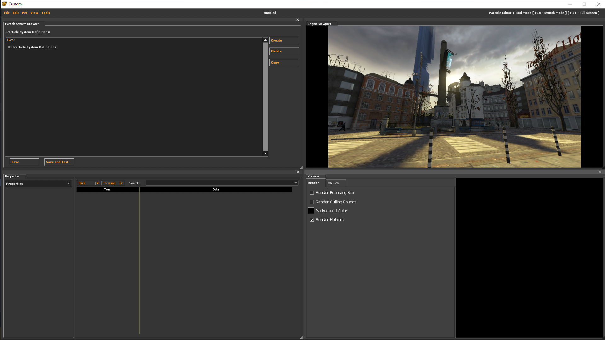
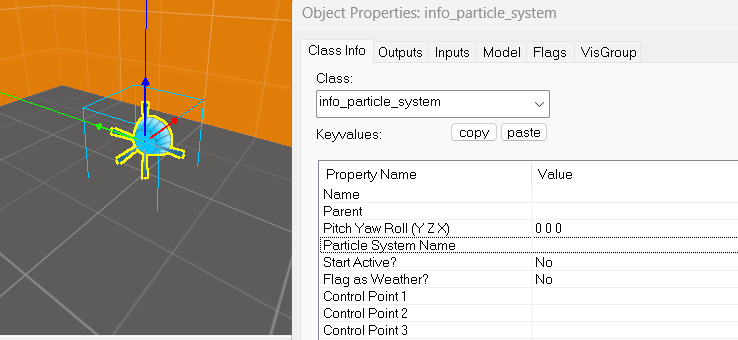

# Éditeur de particules

<https://developer.valvesoftware.com/wiki/Category:Particle_System>

Les particules servent à créer toutes sortes d'effets de la fumée à un feu en passant par un tir au blaster.

Pour ouvrir l'éditeur de particules, il faut mettre la commande.
```
-tools -nop4
```
 en options de lancement steam, une fois lancé aller sur *tools-\>Particle Editor*



Les particules se base sur un matérial

Il existe plusieurs Properties

**Properties**

Permet de selectionner le matérial servant de base aux particules.

**Renderer**

Pemet de définir comment la particule sera dans le rendu.

**Operator**

Permet l'execution d'une fonction sur chaque particule pour chaque image ainsi que le mouvement de celles-ci.

**Initializer**

Permet de Définir l'état de départ des particules crée, ainsi que sa couleur, sa taille ou son alpha.

**Emitter**

Définit le nombre de particules crée et dans quelle période de temps.

## Créez votre premier système de particule

Pour crée son système de particules.

1. Ajouter allons sur les Properties en bas à gauche cliquer dessus et aller sur **Renderer** ajoutez "Animated Sprite Renderer".

2. Nous voulons spécifier où nous avons crée pour cela, nous allons sur **Initializers** puis add "Position Within Sphere Initializer" là-dessus metter "speed_min" et "speed_max' à 64, sans spécifier une position initiale les particules ne sauront pas apparaitre correctement.

3. Sur **Emitter** add "emit_Continuously", vous devrez voir un carré blanc apparaître.

4. Maintenant allons sur **Operator** faite add "Movement Basic" pour faire bouger les particules Maintenant, vous devrez voir bouger les carrés blanc, une fois fait ajoutez "Lifespan decay" cela définit la durée de vie de la particule.

5. Allons sur **Initializer** add "Lifetime Random" nous allons définir la durée de vie sur "lifetime_min" sur 2 et "lifetime_max" sur 4.

6. Maintenant, nous allons prendre un meilleur material que des cubes blancs pour cela allons sur **Properties** et appuyons sur les trois points de "material", nous vous conseillons d'essayer "blueblacklargebeam.vmt" ou "hydragutbeam.vmt".

7. Pour finir sur **Operator**, nous allons ajouter un "Alpha Out Random" cela permet de données une valeur à sa durée de vie, la particule va devenir transparente avant de disparaitre.

Performance

Max_particles

Sur les Properties, nous pouvons définir la valeur maximum des particules de base, elle est à 1000 (1004)m de base, nous n'allons pas dépasser mille particules.

## Particles Function Name

Nous n'allons pas détailler tous les Function Name, mais nous allons décrire les plus importantes.

*Renderer*

*Render_animated_sprites*

C'est le moteur de rendu de base, il crée des sprites animé.

*Render_rope*

Permet de faire un rendu des particules comme une corde.

Très utile pour faire certaines fumées ou des effets d'électricité et de foudre.

*Render_Blobs*

Ce rendu est fait pour les gouttes et les liquides, il est utilisé dans Portal 2 pour le Gel.

*Operators*

*Lifespan Decay*

Avec les "Alpha_fade" Elles Permettent de faire disparaitre les particules cela leurs donne une durée de vie.

*Oscillate*

Permet de faire des effets de particules Ondulé, il y en a deux "Oscillate Scalar" et "Oscillate Vector".


Initializers

Color Random

Permet de donner à certaines particules une couleur aléatoire.

## Mettre et tester les particules dans votre map

Dans hammer placer *infor_partcile_system*.



Pour redemarer les particules

```
ent_fire info_particle_system stop
ent_fire info_particle_system start
```

<div style="page-break-after: always"></div>