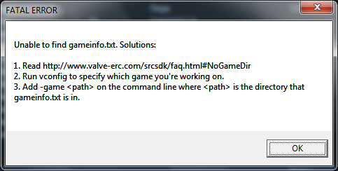
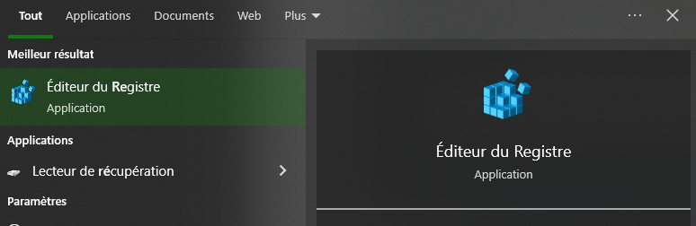

# Problèmes

## *Unable To find gameinfo.txt. Solution:*



Le logiciel utilise ne sait pas quelle est votre projet pour cela nous allons lui donner avec la commande suivante dans la console de window.

Crée un fichier batch (il suffit de créer un fichier bloc note et de mettre à la fin *.bat*).

```
setx VProject "C:\\Program Files(x86)\Steam\steamapps\common\Source SDK Base 2013Singleplayer\«mod_name»\"
```

## Models may not load in Faceposer

Ouvrir l'éditeur de registre et supprimer :	
*HKEY_USERS\\..\\Software\\Valve\\faceposer*



## Steam API

Si vous avez un problème qui empèche le jeu de démarer,
aller dans *steam_api.h* et metter en commentaire les ligne suivantes.

```cpp
/*
m_pSteamMusicRemote = SteamClient()->GetISteamMusicRemote( hSteamUser, hSteamPipe, STEAMMUSICREMOTE_INTERFACE_VERSION );
if ( !m_pSteamMusicRemote )
{
	return false;
}
*/
/*
m_pSteamHTMLSurface = SteamClient()->GetISteamHTMLSurface( hSteamUser, hSteamPipe, STEAMHTMLSURFACE_INTERFACE_VERSION );
if ( !m_pSteamHTMLSurface )
{
	return false;
}
*/
```