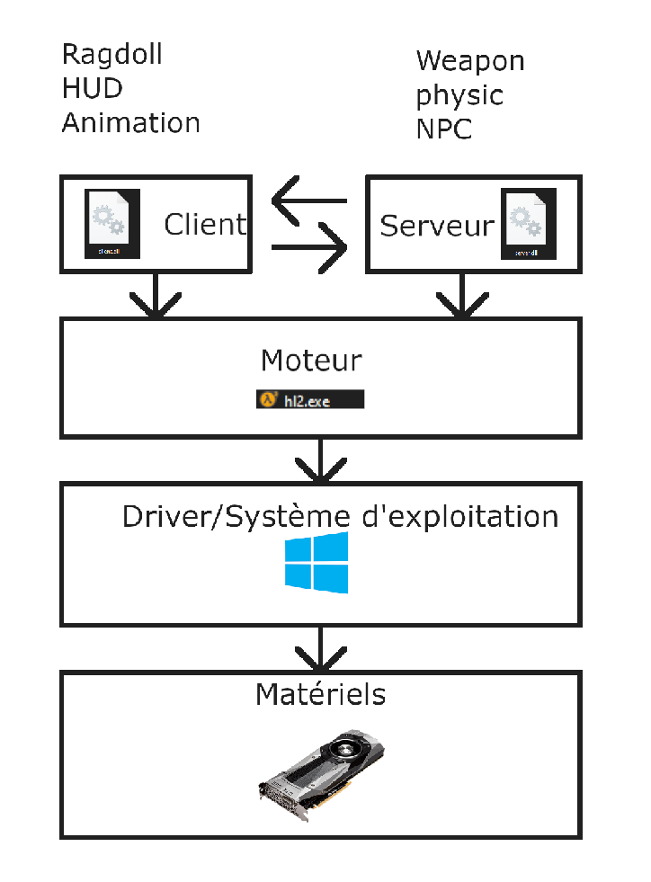
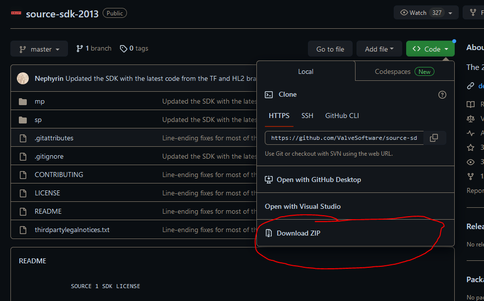
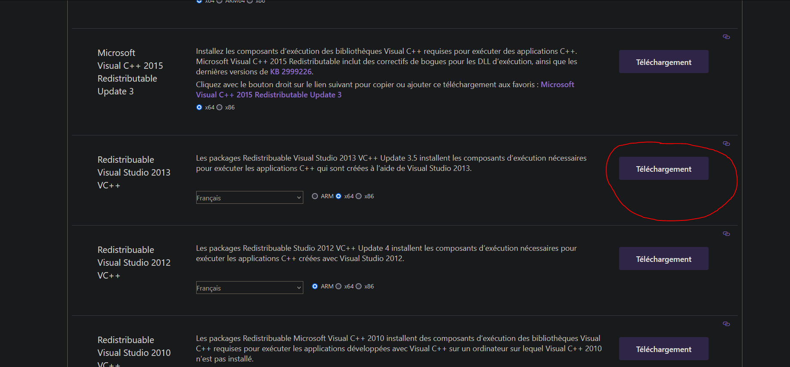
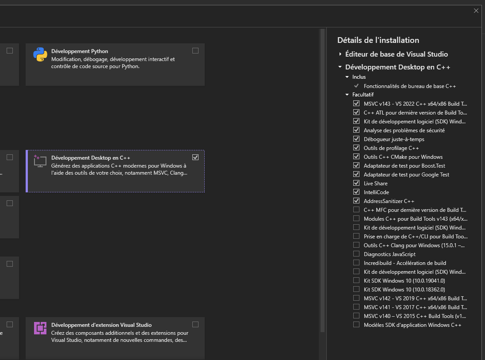
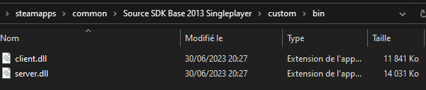
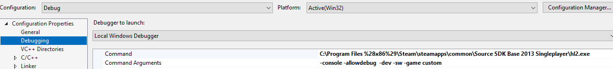

# Programmation en C++

<https://visualstudio.microsoft.com/fr/downloads/>

<https://visualstudio.microsoft.com/fr/vs/older-downloads/>

<https://github.com/ValveSoftware/source-sdk-2013>

<https://git-scm.com/downloads>

<https://archive.org/details/en_visual_studio_community_2013_with_update_5_x86_dvd_6816332>

Avec la programmation, vous pourrez créer vos propres entités que ce soit arme, npc, etc...

Nous allons pouvoir générer deux fichiers *.dll* qui contienne les règles de notre que ce soit côté serveur ou client.



## Téléchargement et installer le code source du source sdk 2013

Maintenant, nous allons télécharger le code sur le lien Github



Si vous avez Git d'installer sur votre ordinateur, vous pouvez utiliser la commande suivante.
```
git clone https://github.com/ValveSoftware/source-sdk-2013
```


Pour apprendre à utiliser Git [cliquer ici](https://www.youtube.com/watch?v=V6Zo68uQPqE&pp=ygUJd2Fnb24gZ2l0).

## Compiler sur Windows

### Installer *Visual Studio*

Pour modifier le code source de notre mode, nous avons besoin de *visual studio* télécharger *visual studio* avec le lien au début du chapitre.


Nous avons aussi besoin pour *sourcesdk 2013* d'avoir les *package Redistribuable de 2013*.

Il faut prendre la version 64 bit (x64).



Installer la version de *visual studio 2013* pour être sûr d'avoir tout l'environnement de compilation.

(Vous pouvez travailler sur *visual studio* 2019 ou 2022, mais il faut avoir la version 2013 installé pour qui puisse fonctionner.)

<https://archive.org/details/en_visual_studio_community_2013_with_update_5_x86_dvd_6816332>

### Installer les fonctionnalités C++ sous Windows

Avec *Visual studio* *installer*, installer les dépendance C++.



### Executer le code

Maintenant exécuter le fichier *creategameprojects.bat* pour créer un projet.


Un fichier *game.sln* devrait apparaître si ce n'est pas le cas les packages Redistribuable 2013 ne sont pas installé ou vous devez redémarrer votre pc.

Un jeu sur le source se comporte de la manière suivante un côté serveur et un côté client avec des règles dans chaque partie.

Le client et le server .*dll* se trouve dans le dossier bin du mod.



*Solutions Explorer -> client (hl2) -> propertie*

*Solutions Explorer -> server (hl2) -> propertie*


Sur *Visual Studio* allez sur Client faites un clique droit dessus cliquer sur *"Properties"*.

Mettre en sortie le dossier bin de **votre mod!**

Faites de même avec Server.


Puis mettre les arguments suivant pour le debugging.
```
-console -allowdebug -dev -sw -game nameOfYourMod
```


Vous pouvez lancer le debugging de votre code.


## Compiler sur Linux

### Installer les fonctionnalités C++ sous Linux

Sous Ubuntu
```bash
sudo apt-get install build-essential
sudo apt-get install gcc-multilib g++-multilib
```
Sous Arch
```bash
sudo pacman -S base-devel gcc dpkg
```
Initialiser le projet.
```bash
cd [SDK_ROOT]/[GAME]/src/
bash ./creategameprojects
```
###  Installer les ressources steam
```bash
cd /
sudo mkdir valve
cd valve
sudo wget https://media.steampowered.com/client/runtime/steam-runtime-sdk_latest.tar.xz
sudo tar xvf steam-runtime-sdk_latest.tar.xz
sudo mv steam-runtime-sdk_2013-09-05 steam-runtime
#sudo chown <USER>:<GROUP> * -R
cd /valve/steam-runtime/
./setup.sh
```
Vous pouvez maintenant compiler.

```bash
make -f [MAKEFILE].mak
```
Pour compiler seulement le client en debug.

```bash
cd /[SDK_ROOT]/[GAME]/src/game/client/
make -f client_linux32_hl2.mak CFG=debug
```

## Crée un nouveau projet

dans *src/vpc_scripts/projects.vgc*.

Par exemple on crée un nouveau projet client.

```
$Project "client"
{
	"game\client\client_hl2.vpc"		[($WIN32||$X360||$POSIX) && $HL2]
	"game\client\client_episodic.vpc"	[($WIN32||$X360||$POSIX) && $EPISODIC]
	"game\client\client_custom.vpc"		[($WIN32||$X360||$POSIX) && $CUSTOM]
}
```

On ajoute le jeu parmis nos projets dans *src/vpc_scripts/default.vgc*.

```
//-----------------------------------------------------------------------------
//	DEFAULT.VGC
//
//	Configurations for all Source(TM) Projects
//-----------------------------------------------------------------------------

////////////////
// Game Names //
////////////////

$Games
{
	"EPISODIC"
	"HL2"
	"CUSTOM"
}

// Makes the VPC scripts work in the SDK's context
$Conditional "SOURCESDK" "1"

$Include "vpc_scripts\projects.vgc"
$Include "vpc_scripts\groups.vgc"
```

Dans le fichier client que nous avons créer.

```
//-----------------------------------------------------------------------------
//	SERVER_CUSTOM.VPC
//
//	Project Script
//-----------------------------------------------------------------------------

$Macro SRCDIR		"..\.."
$Macro GAMENAME 	"custom" [!$SOURCESDK]
$Macro GAMENAME 	"custom" [$SOURCESDK]

$Include "$SRCDIR\game\server\server_base.vpc"

$Configuration
{
	$Compiler
	{
		$AdditionalIncludeDirectories	"$BASE;$SRCDIR\game\shared\hl2;.\hl2;.\custom"
		$PreprocessorDefinitions		"$BASE;HL2_DLL;USES_SAVERESTORE"
	}
}

$Project "Server (custom)" //name of project
{
	$Folder	"Source Files" //Folder with source files
	{

		$Folder "custom"
		{
			$File	"custom\message_player.cpp"
			$File	"custom\message_player.h"
		}
	}
}
```

Plus qu'ajouter le projet dans le fichier *creategameprojects.bat*.

```
devtools\bin\vpc.exe /hl2 /episodic /custom +game /mksln games.sln
```

## Ajouter une entité

http://en.wikipedia.org/wiki/C%2B%2B

Les entités ont le mode defonctionnement suivant :

- constructor :  Qui va mettre les valeurs par défaut.
- Spawn : Quant entité va apparaitre (calcule de colision, model 3D, etc...)
- Activate : Activation de l'entité.
- Think : Routine de l'entité.


Ajouter un fichier *header* (*.h*) avec notre *class*.

Il faut déclarer la *class* avec un nom et la *class* dont elle hérite. Pour une entité, ont hérite de *CBaseEntity*.
```cpp
/**
* @file message_player.h
*/

#pragma once

#include "cbase.h"
/**
* @class Message_Player
*/
class Message_Player : public CBaseEntity

{

    DECLARE_CLASS(Message_Player, CBaseEntity);
    
    public:
    
    Message_Player();
    
    void Spawn();

};
```
On va ensuite écrire ce que vont faires les fonctions dans le fichier c++ (*.cpp*).

Ici, on va juste afficher un message dans la console et lier notre *class* à une entité.
```cpp
/**
* @file message_player.cpp
*/

#include "cbase.h"

#include "message_player.h"
/**
*
*/
Message_Player::Message_Player() {

}

/**
*
*/
void Message_Player::Spawn() {

    BaseClass::Spawn(); // Call the base class\'s Spawn function
    
    Msg("Message player\n");
    
    Msg("Ma grosse bite 2\n");
    
    // Perform any necessary initialization when the entity is spawned in the game

}

LINK_ENTITY_TO_CLASS(message_player, Message_Player);
```
On peut placer notre entité dans *hammer*.

<span style="color: #F00E0E">Attention</span> : Il se peut que votre entité crée ne soit pas répertorié dans *hammer* et que vous avez le logo obsolète pour ajouter votre *class* à la liste, cf. [Ajouter une entité dans le répertoire de hammer](entity.md#ajouter-une-entite-dans-le-repertoire-de-hammer).


## Changer la vitesse du joueur

Dans le fichier *hl2_player.cpp*.

```cpp
ConVar hl2_walkspeed( "hl2_walkspeed", "150" );
ConVar hl2_normspeed( "hl2_normspeed", "190" );
ConVar hl2_sprintspeed( "hl2_sprintspeed", "320" );
```
Nous avons 3 valeurs de vitesse que nous pouvons modifier.

Ou dans le fichier *shareddefs.h*.
```cpp
#define MAX_CLIMB_SPEED		200

#if defined(TF_DLL) || defined(TF_CLIENT_DLL)
	#define TIME_TO_DUCK		0.2
	#define TIME_TO_DUCK_MS		200.0f
#else
	#define TIME_TO_DUCK		0.4
	#define TIME_TO_DUCK_MS		400.0f
#endif 
#define TIME_TO_UNDUCK		0.2
#define TIME_TO_UNDUCK_MS	200.0f
```

<div style="page-break-after: always"></div>