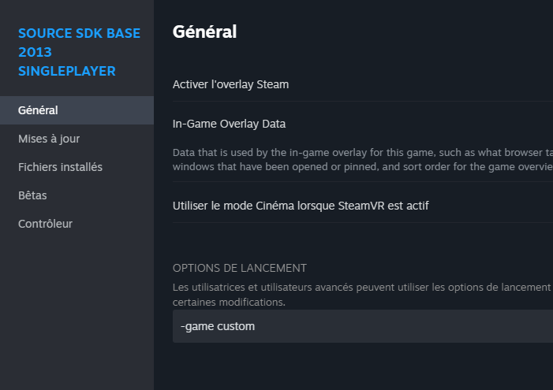

# Les Répertoires et création d'un projet

<https://developer.valvesoftware.com/wiki/Source_SDK_Files_and_Directory_Structure>

Ce chapitre à pour but de vous expliquer comment marche le système de fichier d'un jeu qui marche avec le Source. Pour placer correctement vos différentes ressources, il faut crée un fichier GameInfo.txt pour indiquer de quel type de jeu qu'il s'agit.

## Répertoire Racine

Les jeux source on ce système de répertoire

Le Dossier *Bin*, possède les outils et les bibliothèques du moteur, aller ici pour trouver Hammer.

Le dossier avec les données (hl2 pour Half-Life 2, left4dead2 pour Left4 Dead 2, etc.)

Vous pouvez trouver les fichiers de votre jeu sur les paramètres devotre jeu Steam, cliquer sur l'engrenage
puis sur fichiers locaux.

-Des dossiers de données supplémentaire lier au langues ou DLC (ce n'est pas très important pour le moment)

## Création de projet et répertoires des données

(Si ces dossiers n'apparaissent pas, c'est normal, ils sont pour la plupart compressé en *.vpk*)

Dans les fichiers du jeu dont nous voulons en faire un mod crée un dossier avec le nom du mod dans notre exemple, nous allons l'appeler "*custom*"

Dans ce dossier, nous allons créer plusieurs dossiers voici leurs utilités

**bin**: server.dll et client.dll contient le code compilé du mod

**cfg**: Contient des lignes de commande pour la console format *.cfg*

**expressions**: expresion des npcs pour les scenes de dialogue *.txt*

**maps**: pour mettre les cartes en format .bps

**mapsrc**: cartes au format *.vmt* pour qu'on puisse les ouvrirs avec hammer.

**materials**: pour mettre les textures des modèles importés *.vmt* et *.vtf*

**materialsrc**: Texture non comprésé et non exporté dans le format valve

**media**: vidéo au format *.bik*

**models**: pour mettre les modèles importés .mdl

**modelsrc**: fichier *.smd* et *.qc* du model (vous pouvez mettre en plus le fichier blender)

**mapsrc/prefabs:** pour y mettre les préfabriquer des maps

**particles**: mettre vos particules crée *.pcf*

**ressources**: ressource divers du jeu (police, icone, menu, etc\...)

**save**: sauvegarde du jeu *.sav*

**scenes**: scene de dialogue des npcs format *.vcd*

**scripts**: pour mettre les scripts *.txt*

**src**: mettre ici le code c++ fichier *.cpp* et *.h*

Les dossiers rc (modelsrc, src, etc...) sont uniquement destinée aux développeurs.

## GameInfo

Dans le dossier de votre mod, vous devez avoir un *gameinfo.txt* qui contient les informations primaires de votre mod (Titre, SearchPath, etc...).

Le fichier gameinfo.txt décrit votre mod. Il contient des métadonnées comme le nom du mod, un lien vers votre site web et un manuel, et définit comment on peut y accéder. Ce fichier est stocké dans le dossier principal de votre mod, et il fait office de marqueur pour Steam, Source et le Source SDK pour détecter son existence.

cf. [Exemple GameInfo.txt](ressource/gameinfo.txt)

## Lancer le mod

Fait la commande *-game «yourModName»* (dans notre cas custom)

