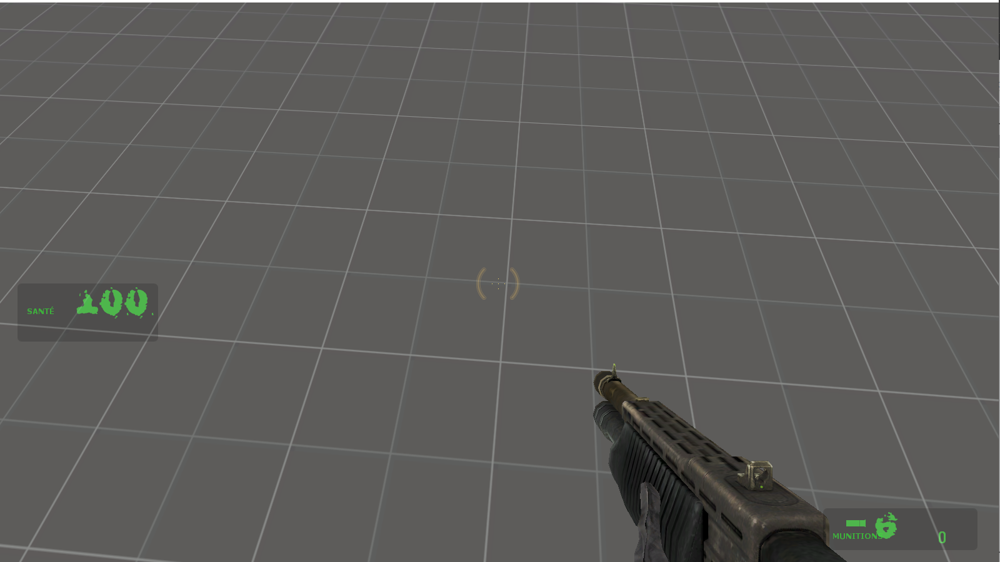

# Textes ,langues et ressources

Ce chapitre a pour but d'apprendre à utiliser les données contenues dans le dossier «*Ressource*» du mod, ces fichiers correspond beaucoup où sont placés les textes, dans quelle police.

| File                           | Description                                                                                   |
|-------------------------------|-----------------------------------------------------------------------------------------------|
| `gameinfo.txt`                 | Set mod title, icon, and other settings                                                       |
| `maplist.txt`                  | List maps used by the mod                                                                     |
| `Resource/SourceScheme.res`    | Change GUI appearance                                                                         |
| `resource/gamemenu.res`        | Change the UI menu buttons. See Manipulating the game menu items                              |
| `scripts/titles.txt`           | Set some localized strings. See Adding chapters to your mod                                   |
| `scripts/ChapterBackgrounds.txt` | List the chapter background images (used until background map is loaded). See Adding chapters to your mod |
| `scripts/kb_act.lst`           | Set the contents of the Keyboard tab of the Options menu.                                     |
| `cfg/config_default.cfg`       | Set the default keyboard layout                                                               |
| `cfg/user_default.scr`         | Add convars to the multiplayer advanced tab.                                                  |
| `Server Settings GUI`          | Edit the local and dedicated server settings pages.                                           |


## Changer la police du jeu

Nous avons besoin d'un d'avoir un fichier *.ttf*, aller dans «*ressource/clientscheme.res*»

```
CustomFontFiles
{
    "1" "resource/Xposed.ttf"
}
```

Ajouter votre police dans la liste, vous pouvez changer maintenant utiliser cette police, nous pouvons changer la police du titre du jeu
```
ClientTitleFont

{

    "1"
    
    {
    
        "name" "Xposed"
        
        "tall" "32"
        
        "tall_hidef" "46"
        
        "weight" "0"
        
        "additive" "0"
        
        "antialias" "1"
        
        "custom" "1" [$OSX]
    
    }
}
```
## Changer le menu

Dans le fichier «*ressource/gamemenu.res*»
```
"label" "Resume Game" //*Texte afficher*

"command" "ResumeGame" *//commande dans la console*

"OnlyInGame" "1" *//Ne s'affiche que en jeu (ex: sauvegarde )*

"notmulti" "1" //Ne s'affiche pas si multijoueur
```
## Interface utilisateur

<https://developer.valvesoftware.com/wiki/HudLayout.res>

L'interface utilisateur est codé en C++ avec la bibliothèque VGUI qui permet de définir les priorités de la fenêtre, c'est ensuite à nous de modifier les variables avec le fichier *scripts/hudlayout.res* et définir les animations avec *hudanimation.txt*.

## Modifier l'affichage des points de vie
```
"Resource/HudLayout.res"

{

    HudHealth [$WIN32]
    
    {
    
        "fieldName" "HudHealth"
        
        "xpos" "16"
        
        "ypos" "432"
        
        "wide" "102"
        
        "tall" "36"
        
        "visible" "1"
        
        "enabled" "1"
        
        "PaintBackgroundType" "2"
        
        "text_xpos" "8"
        
        "text_ypos" "20"
        
        "digit_xpos" "50"
        
        "digit_ypos" "2"

    }
```



## Modifier une fenêtre VGUI 

Mettre votre souris sur une fenêtre et faire SHIFT+CTRL+ALT+B. Vous ouvrez le *VGUI Build Mode Editor* permettant de modifier une fenêtre.


Dans le fichier «ressource/clientscheme.res» nous pouvons modifier où est affiché le logo du jeu dans le menu.

On modifie sa position en X et Y les chiffres correspondent au pixel.
```
// Top-left corner of the \"Half-Life 2\" on the main screen

"Main.Title1.X" "53"

"Main.Title1.Y" "190"

"Main.Title1.Y_hidef" "184"

"Main.Title1.Color" "255 255 255 255"
```

Pour Changer la couleur des menus, dans le fichier *«ressource/clientscheme.res»*.

Les 4 arguments correspond à dans l'ordre Rouge, Vert, Bleu et opacité (transparence) avec une valeur comprise entre 0 et 255 (Pour un octet, un octet fessant 8 bits, cela nous fait 2\^8=256 possibilités différentes).


```
///////////////////// BASE SETTINGS ////////////////////////

//

// default settings for all panels

// controls use these to determine their settings

BaseSettings

{

    "FgColor" "0 255 0 100"
    
    "FgColor_vrmode" "0 255 0 200"
    
    "BgColor" "0 0 0 76"
    
    "Panel.FgColor" "0 255 0 100"
    
    "Panel.BgColor" "0 0 0 76"
    
    "BrightFg" "0 255 0 255"
    
    "DamagedBg" "180 0 0 200"
    
    "DamagedFg" "180 0 0 230"
    
    "BrightDamagedFg" "255 0 0 255"
    
    // weapon selection colors
    
    "SelectionNumberFg" "0 255 0 255"
    
    "SelectionTextFg" "0 255 0 255"
    
    "SelectionEmptyBoxBg" "0 0 0 80"
    
    "SelectionBoxBg" "0 0 0 80"
    
    "SelectionSelectedBoxBg" "0 0 0 80"
    
    "ZoomReticleColor" " 255 220 0 255"
    
    // HL1-style HUD colors
    
    "Yellowish" "0 255 0 255"
    
    "Normal" "255 208 64 255"
    
    "Caution" "255 48 0 255"
```


<div style="page-break-after: always"></div>