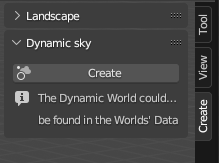
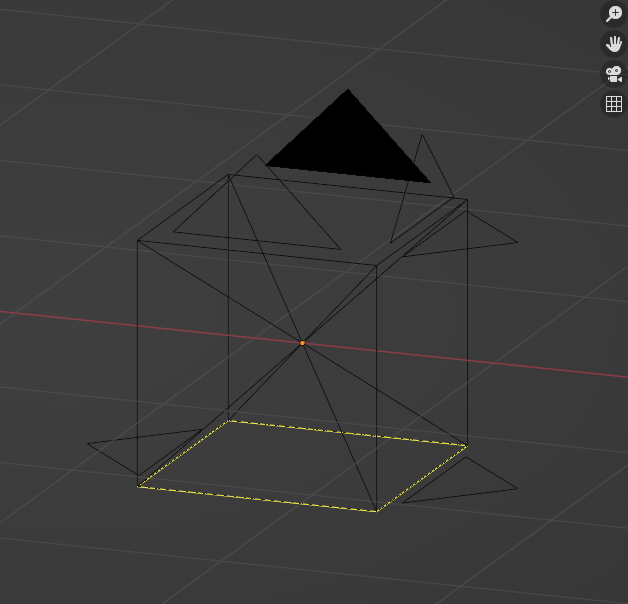
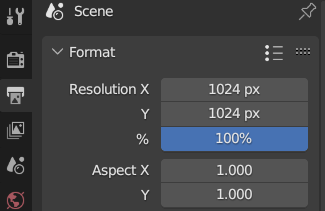
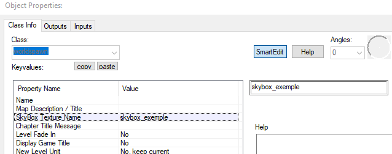

# Skybox

Une Skybox permet de créer un ciel dans les jeux vidéo, il en existe deux les Skybox 2D et les Skybox 3D.

## SkyBox 2D

### Crée une skybox avec blender
Pour faire une Skybox 2D, nous allons utiliser Blender.

Dans Blender ajouter les add-ons suivant, ils sont de base sur Blender.
(pour aller sur les add-on allez sur Edit->Preferences puis add-on)

Appuyer sur "N" pour faire défiler le menu create et pouvoir crée ajouter un Landscape et un ciel.

Ajouter ensuite le ciel crée dans la scène et assurer vous bien d'être en *Renderer* dans les *viewport shading* (le cercle tout à droite).

Dans les Properties (en bas à droite de l'écran) allez sur World.

Cliquer sur le globe où est écrit world et sélectionner "Dynamic_1".

Vous pouvez ajouter un landscape pour avoir des montagne en arrière plan.

Mettre 6 Caméra pour capturer un cube de la scène afin de pouvoir capturer tout la scène.

Changer la résolution et la focal pour bien former un cube.

 

### Nommer vos fichiers

Pour que le moteur fasse le lien entre vos 6 texutre il faut respecter les noms des fichiers.

Les 6 textures doive avoir les noms suivante.

materials\skybox\skybox_exemple**up**.vmf

materials\skybox\skybox_exemple**ft**.vmf

materials\skybox\skybox_exemple**lf**.vmf

materials\skybox\skybox_exemple**rt**.vmf

materials\skybox\skybox_exemple**dn**.vmf

materials\skybox\skybox_exemple**bk**.vmf

### Appliquer la skybox sur Hammer

Pour changer la skybox.

Allez dans le menu *Map->Map Properties*.

## SkyBox 3D

Crée un décor à part du reste du niveau.

Placer une *sky_camera*.

Exemple de Skybox 3D.

*steamapps\common\sourcesdk_content\hl2\mapsrc\sdk_d1_trainstation_02.vmf*.

Dans le dossier "*sourcesdk_content*" nous avons une liste de cartes.

Dans la carte *mapsrc\sdk_d1_trainstation_02.vmf* nous voyons la Tour de Cité 17 du jeu *Half-Life 2* qui est mise à part du reste du décors.

