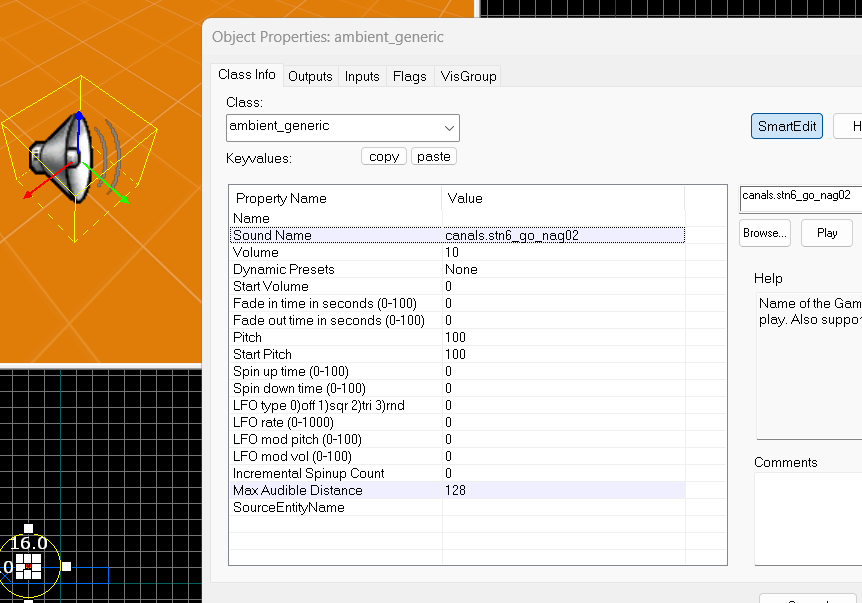

# Sons et musiques

Le format doit être en en *.wav* ou *.mp3* en 16 bits quantification avec 44.1 KHz en fréquence d'échantillonage.


## Lire un fichier son dans hammer

Ajouter votre fichier audio dans la liste des fichiers audio.

Crée un fichier *scripts/mymod_sounds.txt*.

```
"nameofmysound"
{
	"channel"		"CHAN_AUTO"
	"volume"		"VOL_NORM"
	"pitch"			"95, 105"

	"soundlevel"	"SNDLVL_GUNFIRE"

	"wave"			"sounds/fileofmysound.wav"
}
```
https://developer.valvesoftware.com/wiki/Soundscripts

Puis ajouter votre fichiers dans *scripts/game_sounds_manifest.txt*.

Sur Hammer vous devez mettre un *ambient_generic*.



Vous avez l'option *play_everywhere* dans les Flags.

## Changer le son de l'interface

Dans le fichier *hl2_client.cpp*, on a tout les fichiers chargé par défault dans la mémoire.

```cpp
//-----------------------------------------------------------------------------
// Purpose: Precache game-specific models & sounds
//-----------------------------------------------------------------------------
void ClientGamePrecache( void )
{
	CBaseEntity::PrecacheModel("models/player.mdl");
	CBaseEntity::PrecacheModel( "models/gibs/agibs.mdl" );
	CBaseEntity::PrecacheModel ("models/weapons/v_hands.mdl");

	CBaseEntity::PrecacheScriptSound( "HUDQuickInfo.LowAmmo" );
	CBaseEntity::PrecacheScriptSound( "HUDQuickInfo.LowHealth" );

	CBaseEntity::PrecacheScriptSound( "FX_AntlionImpact.ShellImpact" );
	CBaseEntity::PrecacheScriptSound( "Missile.ShotDown" );
	CBaseEntity::PrecacheScriptSound( "Bullets.DefaultNearmiss" );
	CBaseEntity::PrecacheScriptSound( "Bullets.GunshipNearmiss" );
	CBaseEntity::PrecacheScriptSound( "Bullets.StriderNearmiss" );
	
	CBaseEntity::PrecacheScriptSound( "Geiger.BeepHigh" );
	CBaseEntity::PrecacheScriptSound( "Geiger.BeepLow" );
}
```

Dans *scripts/game_sounds_ui.txt*, nous avons les deux scripts avec le son qui est joué.

```
"HUDQuickInfo.LowHealth"
{
	"channel"		"CHAN_ITEM"
	"volume"		"0.8"
	"pitch"			"PITCH_NORM"

	"soundlevel"	"SNDLVL_NONE"

	"wave"			"common/warning.wav"
}

"HUDQuickInfo.LowAmmo"
{
	"channel"		"CHAN_ITEM"
	"volume"		"0.8"
	"pitch"			"PITCH_NORM"

	"soundlevel"	"SNDLVL_NONE"

	"wave"			"common/warning.wav"
}
```

Voici l'algorithme qui joue le son, dans le fichier *hud_quickinfo.cpp* la fonction *void CHUDQuickInfo::Paint()*

```cpp
if ( health != m_lastHealth )
	{
		UpdateEventTime();
		m_lastHealth = health;

		if ( health <= HEALTH_WARNING_THRESHOLD )
		{
			if ( m_warnHealth == false )
			{
				m_healthFade = 255;
				m_warnHealth = true;
				
				CLocalPlayerFilter filter;
				C_BaseEntity::EmitSound( filter, SOUND_FROM_LOCAL_PLAYER, "HUDQuickInfo.LowHealth" );
			}
		}
		else
		{
			m_warnHealth = false;
		}
	}

```

<div style="page-break-after: always"></div>