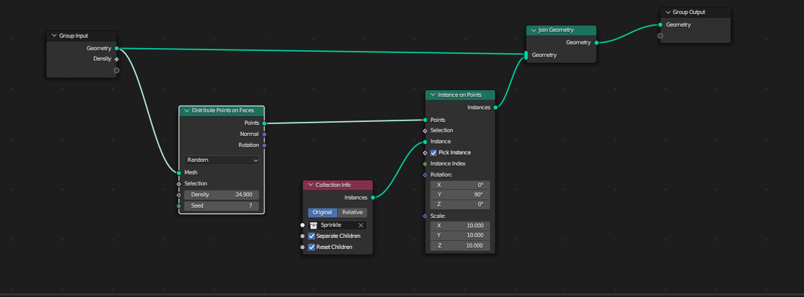

# Sprinkle

*Sprinkle* est un outil qui permet de placer des modèles 3d de manière aléatoire sur une surface, cela est très pratique pour faire une forêt ou une pile de cadavre sur *Hammer++*.

## Sur Blender

[Blender Beginner Tutorial Part 9: Geometry Nodes](https://youtu.be/4WAxMI1QJMQ?list=PLjEaoINr3zgFX8ZsChQVQsuDSjEqdWMAD)

Il faut créer les objets que l'on veut appliquer et les mettre dans une collection à part que l'on va appeler "*Sprinkle*".

Crée un join géometty.

Crée un "Distribute Points of Face " Relier le au Group Input et Join Geometry.

Crée un Instance of Points que l'on met entre "Distrivute Points of Face" et Instance of Points.

Crée un "Collection Info" avec la collection "Sprinkle" selectionné relié l'instance avec celle de "Instance of Points".



## Sur Hammer++

Il suffit de cliquer sur l'outil Sprinkle.

Appuyer sur Open Source.

Nous allons copier le fichier texte "Example" et copié.

Dans notre exemple, nous allons renommer les modèles en format *mdl*.

Les passages soulignés sont à modifier.
```
"DeadBody" //This is what shows up in Type
{
    base //The base values of what you want to sprinkle. Every entity will have these values, but you do not need to put anything here   
    {
        "classname" "prop_static"
        grid "64 64" // The default grid size of this type, this can be overridden in Hammer
    
    }
    10 //This is the chance of this set of values being used, this can be any number
    {
        "model" "models/gibs/agibs.mdl" //The values of this case
        "ignorenormals" "1" //This is good for foilage props
    }
    10
    {
        "model" "models/gibs/fast_zombie_legs.mdl" 
        "skin" "0"
        "ignorenormals" "1"
    }
    10
    {
        "model" "models/gibs/fast_zombie_torso.mdl"
        "skin" "1"
        "ignorenormals" "1"
    }
    10 //Since there's 4 cases with the same chance, each case has a 1/4 chance of being placed
    {
        "model" "models/gibs/agibs.mdl"
        "ignorenormals" "1"
    }
}
```
Après, nous allons sélectionner *DeadBody* et mode additive dans notre exemple, nous allons avoir pleins de cadavres.

<div style="page-break-after: always"></div>