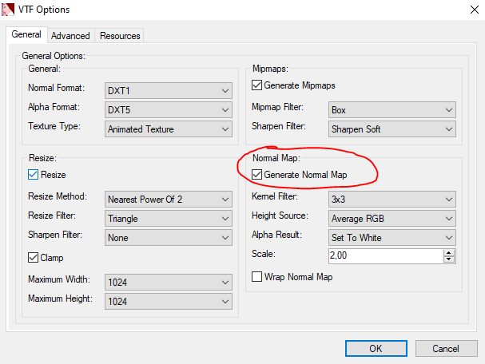
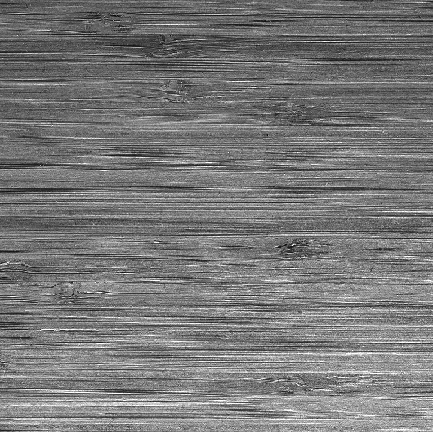
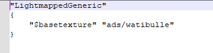

# Les Textures

<https://github.com/NeilJed/VTFLib>

Une texture est une ou plusieurs images que nous allons utiliser en jeu, que ce soit pour l'interface, les murs des bâtiments ou les modèles 3D.

Pour utiliser les images, nous avons besoins de les convertis dans un format le *.VTF* et ensuite les répertorier avec un *.VMF*.

## Crée une Texture

Nous avons plusieurs moyens de faire une texture, cela peut se faire avec un dessin ou en prenant une photo.

Les dimensions des textures sont le plus souvent des multiples de 2 *256x256px, 512x512px*.

Malheureusement cela ne suffit pas à créer une texture ! En effet, certaines textures sont composées de plusieurs Images comme pour la réflexion de la lumière, la profondeur etc\... Quand la texture possède cela, on appelle sa un *materials*.

Pour plus de détails cliquer ici [Web TV - #10 La 3D : Améliorer les Textures](https://www.youtube.com/watch?v=Kt3KqKL1HZE)


## Crée une normal map 


Une normal crée des effets de reliefs sur la texture


Pour en créer une, il faut importer sa texture sur un logiciel de retouche d'image comme Gimp ou Photoshop voici comment faire.

### Photoshop 

Filter → 3D → Generate Normal Map

il suffit d'exporter sa normal File → Export

### Gimp

Filter->generic->Normal map

### VTFEdit

Quand vous importer une texture, cocher «Generate Normal Map».



## Bump Map

Une Bump Map permet de simuler les bosses et les creux

Comme pour la normal map le bump mapping va convertir l'image en une autre image, une image en nuance de gris, en blanc ce sont les bosses et en noir ce sont les creux.



## Materials

Le materials regroupe toutes les textures qui compose notre image en un seul fichier


## Convertir une texture en VTF

<https://github.com/NeilJed/VTFLib>

Hammer ne lit que les fichiers *VTF*, pour *Valve Texture Format*.

Heureusement, nous avons le logiciel *VTFLib* pour convertir en VTF.

Utiliser le logiciel *VTFLib*. (Ce n'est pas compliqué, il est en lien juste en haut)

Vous avez juste faire Import votre Image et magique, elle est convertit en *VTF* !

Sauvegarder là et placer là, dans le dossier materials de votre mod.


Le fichier VMT pour *Valve Material* indique, tout les image dans la texture. Il crée un *material*.

Nous allons importer le fichier image puis exporter en VMT.

*Tools->Create_VMT*


On va mettre tous les éléments qui constitue notre texture (normal, bump, ect..). 
Il reste plus que l'on mette sa dans le dossier «*materials*» et c'est bon.

(Attention *VMT* est juste un fichier texte normal, n'oublier pas de mettre les fichiers *VTF* avec.)

## Changer le shader de la texture

Votre Texture à un Shader, par default c'est *LightmappedGeneric* qui fait adapter pour les textures de mur.


Pour les modèles 3D le *.vmt* doit être en "*VertexlitGeneric*" comme shader.

Maintenant, vous pouvez créer et placer vos *.vmt* dans le même dossier que votre texture (materials).

Vous devriez avoir quelque chose qui devrait ressemble à sa.

(*«modname»\materials\ads\watibulle.vmt
«modname»\materials\ads\watibulle.vtf*)



```
"LightmappedGeneric"
{
	"$basetexture" "ads/watibulle"
}
```

## Texture Blend

<https://developer.valvesoftware.com/wiki/$blendmodulatetexture>

La texture blend est un mélange de deux textures, elles sont très pratiques pour ajouter  des aspérités.


Pour créer, nous avons besoin des deux textures est une texture *modulate* rouge et vert qui va indiquer comment doive se mélanger les deux textures.


```
"WorldVertexTransition"
{
	"$basetexture" "urban/blend_stone_tiles_diffuse"
	"$bumpmap" "urban/blend_stone_tiles_normal"
	"$basetexture2" "urban/blend_stone_tiles_mud_forest_diffuse"
	"$bumpmap2" "urban/blend_stone_tiles_mud_forest_normal"
	"$surfaceprop" "Brick"
	"$surfaceprop2" "Dirt"
	"$basetexturetransform" "center .5 .5 scale 2 2 rotate 0  translate 0 0"
    "$basetexturetransform2" "center .5 .5 scale 4 4 rotate 0 translate 0 0"
	"$alphatest" 1
}
```

Pour utiliser la texture blend  cf.[Utiliser les textures Blends](hammer.md#utiliser-les-textures-blends)

## Texture Devs

Les Textures dev sont des textures créer par Valve pour aider aux mesures.

*dev_measurewall*


Celle-ci permettent de connaitre mesures avec la taille d'un mur soit 128 sur 128 soit 2.5m.

"*dev_measurewall01c*" mets en avant la taille du joueur.

<div style="page-break-after: always"></div>