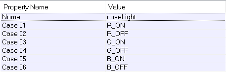

# Trigger et algorithme dans hammer

<https://developer.valvesoftware.com/wiki/Category:IO_System>

Dans Hammer nous pouvons activer des scripts (Dialogue, apparition d'ennemi, etc...), cela peut se faire en marchant à un endroit précis où au chargement de la map.

## Activer un script

Avec l'entité *logic_auto*, nous pouvons activer un script au démarage de la map.

 

- Il faut mettre *OnMapSpawn* dans les paramètres.
- Mettre le nom de l'entité en argument.
- Qu'elle type d'entrée va recevoir l'entité.
- Une autre valeur en argument d'entrée.

Pour placer un trigger crée un block puis le transformer en entité (CTRL + T).

*Trigger_once* qui s'active une fois ou *Trigger_multiple* qui peut s'activer plusieurs fois.

Assurez vous que le Flags *Clients* est activer.

## Machine à état

Une machine à état est un principe séquentielle, où l'on va donner un état qui va changer en fonction de la valeur qui recois en entré.

Metter l'entité *logic_case* dans hammer pour créer des etats.

Exemple avec un système de lumière qui alume une lumière rouge puis vert et bleue.

 

Dans l'exemple au dessus nous avons 6 états possible, ces états définise l'état de 3 lumières, 1 rouge, 1 verte, 1 bleue.
- case 1 (R_ON)  : Met l'entité "light_night_R" sur on, puis après un delay vas entrer dans l'etat 2.
- case 2 (R_OFF) : Met l'entité "light_night_R" sur off, puis après un delay vas entrer dans l'etat 3.
- case 3 (G_ON)  : Met l'entité "light_night_G" sur on, puis après un delay vas entrer dans l'etat 4.
- case 4 (G_OFF) : Met l'entité "light_night_G" sur on, puis après un delay vas entrer dans l'etat 5.
- case 5 (B_ON)  : Met l'entité "light_night_B" sur on, puis après un delay vas entrer dans l'etat 6.
- case 6 (B_OFF) : Met l'entité "light_night_B" sur on, puis après un delay vas entrer dans l'etat 1.

