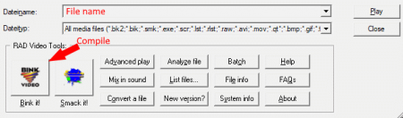

# Videos

<https://developer.valvesoftware.com/wiki/Startup_Video_add/edit/remove>

<https://developer.valvesoftware.com/wiki/BIK>

<http://www.radgametools.com/bnkdown.htm>


## Exporter en format .bik

Prener votre fichier vidéo et exporter le *.bik* avec le logiciel RAD video tool.




## Video au démarage

Modifier le fichier *media/startupvids.txt*
```
{
	media/YourFileName.bik
	media/valve.bik(default)
}
```

<div style="page-break-after: always"></div>